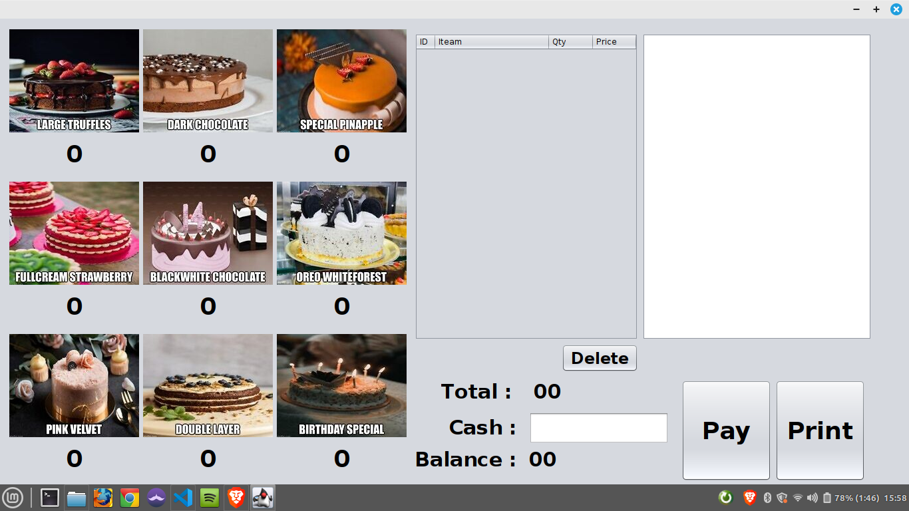
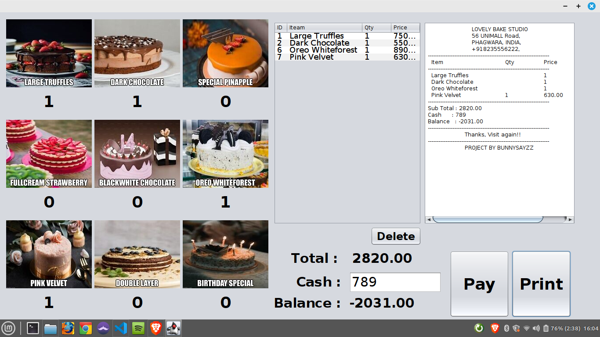

Point of Sale System
This is a Java project that implements a Point of Sale (POS) system using the javax package. The system allows a user to input the products being sold and calculate the total cost of the transaction.

Requirements
Java SE Development Kit 8 or higher
Eclipse IDE (or any Java IDE of your choice)
Installation
Clone or download the repository to your local machine.
Import the project into Eclipse.
Build the project.
Run the PointOfSaleSystem.java file.
Usage
Input the item code of the product being sold.
Input the quantity of the product being sold.
Repeat steps 1 and 2 for all products being sold.
When finished inputting products, enter "exit" to calculate the total cost of the transaction.
Notes
The system reads the product information from a text file (products.txt) in the following format: itemCode,productName,productPrice
The system outputs the transaction information to the console.
The system uses a Product class to represent each product, and a Transaction class to represent the transaction as a whole.
The system uses the javax package for user input and output.
Credits
This project was created by [Your Name] as part of [Course Name] at [University Name]. Feel free to use and modify this code for your own projects. If you find any issues or have any suggestions, please let me know by [adding an issue/creating a pull request/filling out the feedback form].

